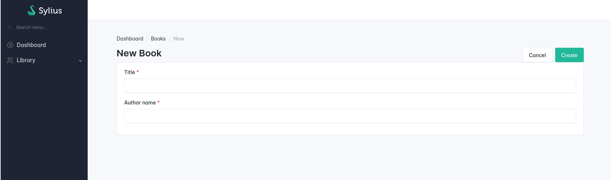
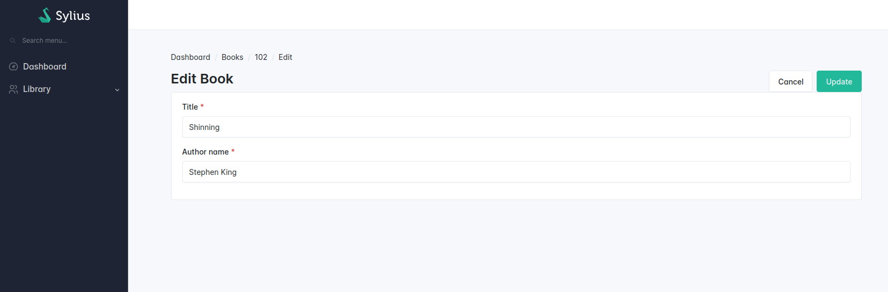
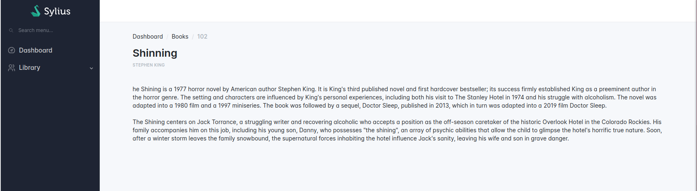

# Basic operations

In this cookbook, we assume that you have already created a `Book` resource.


Learn more on how to [create a Sylius resource](../../resource/create_new_resource.md).


## List of resources

<div data-full-width="false"><figure><figcaption></figcaption></figure></div>

Create a grid for your resource using Symfony's Maker Bundle.

**Note:** To ease the setup, it is recommended to have an existing Doctrine Entity configured.

```shell
bin/console make:grid
bin/console cache:clear # To refresh grid's cache
```

Magic! Here is the generated grid.


```php
<?php

namespace App\Grid;

use App\Entity\Book;
use Sylius\Bundle\GridBundle\Builder\Action\CreateAction;
use Sylius\Bundle\GridBundle\Builder\Action\DeleteAction;
use Sylius\Bundle\GridBundle\Builder\Action\ShowAction;
use Sylius\Bundle\GridBundle\Builder\Action\UpdateAction;
use Sylius\Bundle\GridBundle\Builder\ActionGroup\BulkActionGroup;
use Sylius\Bundle\GridBundle\Builder\ActionGroup\ItemActionGroup;
use Sylius\Bundle\GridBundle\Builder\ActionGroup\MainActionGroup;
use Sylius\Bundle\GridBundle\Builder\Field\DateTimeField;
use Sylius\Bundle\GridBundle\Builder\Field\StringField;
use Sylius\Bundle\GridBundle\Builder\GridBuilderInterface;
use Sylius\Bundle\GridBundle\Grid\AbstractGrid;
use Sylius\Component\Grid\Attribute\AsGrid;

#[AsGrid(
    name: 'app_book',
    resourceClass: Book::class,
)]
final class BookGrid extends AbstractGrid
{
    public function __construct()
    {
        // TODO inject services if required
    }

    public function __invoke(GridBuilderInterface $gridBuilder): void
    {
        $gridBuilder
            // see https://github.com/Sylius/SyliusGridBundle/blob/master/docs/field_types.md
            ->addField(
                StringField::create('title')
                    ->setLabel('Title')
                    ->setSortable(true),
            )
            ->addField(
                StringField::create('author')
                    ->setLabel('Author')
                    ->setSortable(true),
            )
            ->addActionGroup(
                MainActionGroup::create(
                    CreateAction::create(),
                ),
            )
            ->addActionGroup(
                ItemActionGroup::create(
                    // ShowAction::create(),
                    UpdateAction::create(),
                    DeleteAction::create(),
                ),
            )
            ->addActionGroup(
                BulkActionGroup::create(
                    DeleteAction::create(),
                ),
            )
        ;
    }
```


Configure the `index` operation in your resource.




```php
<?php

namespace App\Entity;

use App\Grid\BookGrid;
use Sylius\Resource\Metadata\AsResource;
use Sylius\Resource\Metadata\Index;
use Sylius\Resource\Model\ResourceInterface;

#[AsResource(
    section: 'admin', // This will influence the route name
    routePrefix: '/admin',
    templatesDir: '@SyliusAdmin/shared/crud', // This directory contains the generic template for your list
    operations: [
        new Index( // This operation will add an "index" operation for the books list
            grid: BookGrid::class, // Use the grid class you've just generated above
        ), 
    ],    
)]
class Book implements ResourceInterface
{
    //...
}
```





```php
<?php

namespace App\Entity;

use App\Grid\BookGrid;
use Sylius\Resource\Metadata\AsResource;
use Sylius\Resource\Metadata\Index;
use Sylius\Resource\Model\ResourceInterface;

#[AsResource(
    section: 'admin', // This will influence the route name
    routePrefix: '/admin',
    templatesDir: '@SyliusAdminUi/crud', // This directory contains the generic template for your list
    operations: [
        new Index( // This operation will add an "index" operation for the books list
            grid: BookGrid::class, // Use the grid class you've just generated above
        ), 
    ],    
)]
class Book implements ResourceInterface
{
    //...
}
```




Use the Symfony `debug:router` command to check the results.

```shell
bin/console debug:router
```

Your route should look like this:

```shell
 ------------------------------ ---------------------------
  Name                           Path                                           
 ------------------------------ ---------------------------                  
  app_admin_book_index           /admin/books               
```

## Resource creation page

<div data-full-width="false"><figure><figcaption></figcaption></figure></div>

Create a form type for your resource. You can use the Symfony command to generate your form fields.

```shell
bin/console make:form
```

Here is a basic example of a FormType for your Book resource.


```php
<?php

namespace App\Form;

use App\Entity\Publisher;
use App\Entity\Source;
use App\Entity\Book;
use Symfony\Bridge\Doctrine\Form\Type\EntityType;
use Symfony\Component\Form\AbstractType;
use Symfony\Component\Form\FormBuilderInterface;
use Symfony\Component\OptionsResolver\OptionsResolver;

class BookType extends AbstractType
{
    public function buildForm(FormBuilderInterface $builder, array $options): void
    {
        $builder
            ->add('author', EntityType::class, [
                'class' => Author::class,
                'choice_label' => 'id',
            ])
            ->add('title', TextType::class)
        ;
    }

    public function configureOptions(OptionsResolver $resolver): void
    {
        $resolver->setDefaults([
            'data_class' => Book::class,
        ]);
    }
}
```


Configure the `create` operation in your resource.




```php
<?php

namespace App\Entity;

use App\Grid\BookGrid;
use Sylius\Resource\Metadata\AsResource;
use Sylius\Resource\Metadata\Create;
use Sylius\Resource\Model\ResourceInterface;

#[AsResource(
    section: 'admin', // This will influence the route name
    routePrefix: '/admin',
    templatesDir: '@SyliusAdmin/shared/crud', // This directory contains the generic template for your list
    formType: BookType::class, // The form type you have generated in the previous step
    operations: [
      //...
      new Create(), // This operation will add "create" operation for the book resource
    ],    
)]
class Book implements ResourceInterface
{
    //...
}
```





```php
<?php

namespace App\Entity;

use App\Form\BookType;
use Sylius\Resource\Metadata\AsResource;
use Sylius\Resource\Metadata\Create;
use Sylius\Resource\Model\ResourceInterface;

#[AsResource(
    section: 'admin', // This will influence the route name
    routePrefix: '/admin',
    templatesDir: '@SyliusAdminUi/crud', // This directory contains the generic template for your list
    formType: BookType::class, // The form type you have generated in the previous step
     operations: [
      //...
      new Create(), // This operation will add a "create" operation for the book resource
    ],    
)]
class Book implements ResourceInterface
{
    //...
}
```




Use the Symfony `debug:router` command to check the results.

```shell
bin/console debug:router
```

Your route should look like this:

```shell
 ------------------------------ ---------------------------
  Name                           Path                                           
 ------------------------------ ---------------------------                  
  app_admin_book_create           /admin/books/new               
```

## Resource edition page

<div data-full-width="false"><figure><figcaption></figcaption></figure></div>

Ensure you already created the Symfony form type in the [previous section](basic_operations.md#resource-creation-page).

Configure the `update` operation in your resource.




```php
<?php 

namespace App\Entity;

use App\Form\BookType;
use Sylius\Resource\Metadata\AsResource;
use Sylius\Resource\Metadata\Update;
use Sylius\Resource\Model\ResourceInterface;

#[AsResource(
    section: 'admin', // This will influence the route name
    routePrefix: '/admin',
    templatesDir: '@SyliusAdmin/shared/crud', // This directory contains the generic template for your list
    formType: BookType::class, // The form type you have generated in the previous step
    operations: [
      //...
      new Update(), // This operation will add an "update" operation for the book resource
    ],    
)]
class Book implements ResourceInterface
{
    //...
}
```





```php
<?php

namespace App\Entity;

use App\Form\BookType;
use Sylius\Resource\Metadata\AsResource;
use Sylius\Resource\Metadata\Update;
use Sylius\Resource\Model\ResourceInterface;

#[AsResource(
    section: 'admin', // This will influence the route name
    routePrefix: '/admin',
    templatesDir: '@SyliusAdminUi/crud', // This directory contains the generic template for your list
    formType: BookType::class, // The form type you have generated in the previous step
     operations: [
      //...
      new Update(), // This operation will add an "update" operation for the book resource
    ],    
)]
class Book implements ResourceInterface
{
    //...
}
```




Use the Symfony `debug:router` command to check the results.

```shell
bin/console debug:router
```

Your route should look like this:

```shell
 ------------------------------ ---------------------------
  Name                           Path                                           
 ------------------------------ ---------------------------                  
  app_admin_book_update           /admin/books/{id}/edit              
```

## Resource details page

<div data-full-width="false"><figure><figcaption></figcaption></figure></div>

Configure the `show` operation in your resource.




```php
namespace App\Entity;

use Sylius\Resource\Metadata\AsResource;
use Sylius\Resource\Metadata\Show;
use Sylius\Resource\Model\ResourceInterface;

#[AsResource(
    section: 'admin', // This will influence the route name
    routePrefix: '/admin',
    templatesDir: '@SyliusAdmin/shared/crud', // This directory contains the generic template for your list
    operations: [
      //...
       new Show(), // This operation will add a "show" operation for the book resource
    ],    
)]
class Book implements ResourceInterface
{
    //...
}
```





```php
namespace App\Entity;

use Sylius\Resource\Metadata\AsResource;
use Sylius\Resource\Metadata\Show;
use Sylius\Resource\Model\ResourceInterface;

#[AsResource(
    section: 'admin', // This will influence the route name
    routePrefix: '/admin',
    templatesDir: '@SyliusAdminUi/crud', // This directory contains the generic template for your list
     operations: [
      //...
      new Show(), // This operation will add a "show" operation for the book resource
    ],    
)]
class Book implements ResourceInterface
{
    //...
}
```




Use the Symfony `debug:router` command to check the results.

```shell
bin/console debug:router
```

Your route should look like this:

```shell
 ------------------------------ ---------------------------
  Name                           Path                                           
 ------------------------------ ---------------------------                  
  app_admin_book_show           /admin/books/{id}              
```

Now we need to configure the templates.




```yaml
sylius_twig_hooks:
    hooks:
        # ...
        # This will create the body block
        'sylius_admin.book.show.content':
            body:
                template: 'book/show/content/body.html.twig'
```





```php
<?php 

declare(strict_types=1);

namespace Symfony\Component\DependencyInjection\Loader\Configurator;

return static function (ContainerConfigurator $container): void {
    $container->extension('sylius_twig_hooks', [
        'hooks' => [
            // ...
            // This will create the body block
            'sylius_admin.book.show.content' => [
                'body' => [
                    'template' => 'book/show/content/body.html.twig',
                ],
            ],
        ],
    ]);
};
```





```twig


<div class="page-body">
    <div class="container-xl">
        <div class="row">
            <div class="col-12">
                <p>
                    {{ book.description|nl2br }}
                </p>
            </div>
        </div>
    </div>
</div>
```



Note that you can also [replace the default title](page_titles.md).

