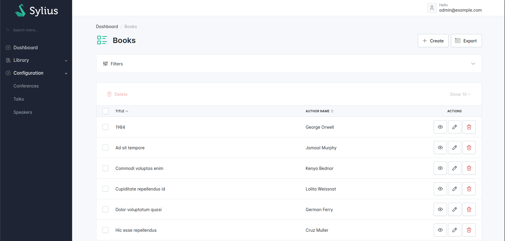

# Exporting grid data

In this cookbook, we assume that you have already created a `Book` resource and configured a grid to show a book list.

In this example, we'll create a CSV export.

<figure></figure>

## The responder

First, create the responder using the [https://github.com/portphp/csv](portphp/csv) package.

```php
<?php

declare(strict_types=1);

namespace App\Responder;

use Pagerfanta\PagerfantaInterface;
use Port\Csv\CsvWriter;
use Sylius\Component\Grid\Definition\Field;
use Sylius\Component\Grid\Renderer\GridRendererInterface;
use Sylius\Component\Grid\View\GridViewInterface;
use Sylius\Resource\Context\Context;
use Sylius\Resource\Metadata\Operation;
use Sylius\Resource\State\ResponderInterface;
use Symfony\Component\DependencyInjection\Attribute\Autowire;
use Symfony\Component\HttpFoundation\StreamedResponse;
use Symfony\Contracts\Translation\TranslatorInterface;
use Webmozart\Assert\Assert;

final readonly class ExportGridToCsvResponder implements ResponderInterface
{
    public function __construct(
        #[Autowire(service: 'sylius.grid.renderer')]
        private GridRendererInterface $gridRenderer,
        private TranslatorInterface $translator,
    ) {
    }

    /**
     * @param GridViewInterface $data
     */
    public function respond(mixed $data, Operation $operation, Context $context): mixed
    {
        Assert::isInstanceOf($data, GridViewInterface::class);

        $response = new StreamedResponse(function () use ($data) {
            $output = fopen('php://output', 'w');

            if (false === $output) {
                throw new \RuntimeException('Unable to open output stream.');
            }

            $writer = new CsvWriter();
            $writer->setStream($output);

            $fields = $this->sortFields($data->getDefinition()->getFields());
            $this->writeHeaders($writer, $fields);
            $this->writeRows($writer, $fields, $data);

            $writer->finish();
        });

        $response->headers->set('Content-Type', 'text/csv; charset=UTF-8');
        $response->headers->set('Content-Disposition', 'attachment; filename="export.csv"');

        return $response;
    }

    /**
     * @param Field[] $fields
     */
    private function writeHeaders(CsvWriter $writer, array $fields): void
    {
        $labels = array_map(fn (Field $field) => $this->translator->trans($field->getLabel()), $fields);

        $writer->writeItem($labels);
    }

    /**
     * @param Field[] $fields
     */
    private function writeRows(CsvWriter $writer, array $fields, GridViewInterface $gridView): void
    {
        /** @var PagerfantaInterface $paginator */
        $paginator = $gridView->getData();
        Assert::isInstanceOf($paginator, PagerfantaInterface::class);

        for ($currentPage = 1; $currentPage <= $paginator->getNbPages(); ++$currentPage) {
            $paginator->setCurrentPage($currentPage);
            $this->writePageResults($writer, $fields, $gridView, $paginator->getCurrentPageResults());
        }
    }

    /**
     * @param Field[] $fields
     * @param iterable<object> $pageResults
     */
    private function writePageResults(CsvWriter $writer, array $fields, GridViewInterface $gridView, iterable $pageResults): void
    {
        foreach ($pageResults as $resource) {
            $rows = [];
            foreach ($fields as $field) {
                $rows[] = $this->getFieldValue($gridView, $field, $resource);
            }
            $writer->writeItem($rows);
        }
    }

    private function getFieldValue(GridViewInterface $gridView, Field $field, object $data): string
    {
        $renderedData = $this->gridRenderer->renderField($gridView, $field, $data);
        $renderedData = str_replace(PHP_EOL, '', $renderedData);

        return trim(strip_tags($renderedData));
    }

    /**
     * @param Field[] $fields
     *
     * @return Field[]
     */
    private function sortFields(array $fields): array
    {
        $sortedFields = $fields;

        uasort($sortedFields, fn (Field $fieldA, Field $fieldB) => $fieldA->getPosition() <=> $fieldB->getPosition());

        return $sortedFields;
    }
}
```

## Configure a new operation


```php
<?php

declare(strict_types=1);

namespace App\Entity;

use App\Shared\Infrastructure\Sylius\Resource\ExportGridToCsvResponder;
use Sylius\Resource\Model\ResourceInterface;

#[AsResource(
    section: 'admin',
    templatesDir: '@SyliusAdminUi/crud',
    routePrefix: '/admin',
    operations: [
        new Index(
            grid: BookGrid::class,
        ),
        new Index(
            shortName: 'export',
            responder: ExportGridToCsvResponder::class,
            grid: BookGrid::class,
        ),
    ],
)]
class Book implements ResourceInterface
{
}
```


## Configure the grid


```php
<?php

declare(strict_types=1);

namespace App\Grid;

use Sylius\Bundle\GridBundle\Builder\Action\Action;
use Sylius\Bundle\GridBundle\Builder\ActionGroup\MainActionGroup;
use Sylius\Bundle\GridBundle\Builder\GridBuilderInterface;
use Sylius\Bundle\GridBundle\Grid\AbstractGrid;
use Sylius\Component\Grid\Attribute\AsGrid;

#[AsGrid(
    // ...
)]
final class BookGrid extends AbstractGrid
{
    #[\Override]
    public function buildGrid(GridBuilderInterface $gridBuilder): void
    {
        $gridBuilder
            // ...
            ->addActionGroup(
                MainActionGroup::create(
                    // ...
                    Action::create('export', 'export')
                        // Optional, you can configure it globally instead.
                        ->setTemplate('shared/grid/action/export.html.twig')
                    ,
                )
            )
        ;
    }
}
```


## Create the export action Twig template

You can configure the template for the export action 


```twig




    


<a href="{{ path }}?{{ app.request.query.all()|url_encode }}" class="btn">
    {{ ux_icon(action.icon|default('iwwa:csv'), {class: 'icon dropdown-item-icon'}) }}
    {{ message|trans }}
</a>
```


## Configure the translation key

In the export action Twig template, we have introduced the `app.ui.translation` translation key.
So we need to configure its translation.


```yaml
app:
    ui:
        # ...
        export: Export
```


## Configure the export action template in the grid bundle globally

If you do not want to repeat the `setTemplate` option in your grid configurations, you can configure it globally in the Grid bundle.


```yaml
sylius_grid:
    templates:
        action:
            export: 'shared/grid/action/export.html.twig'
```
