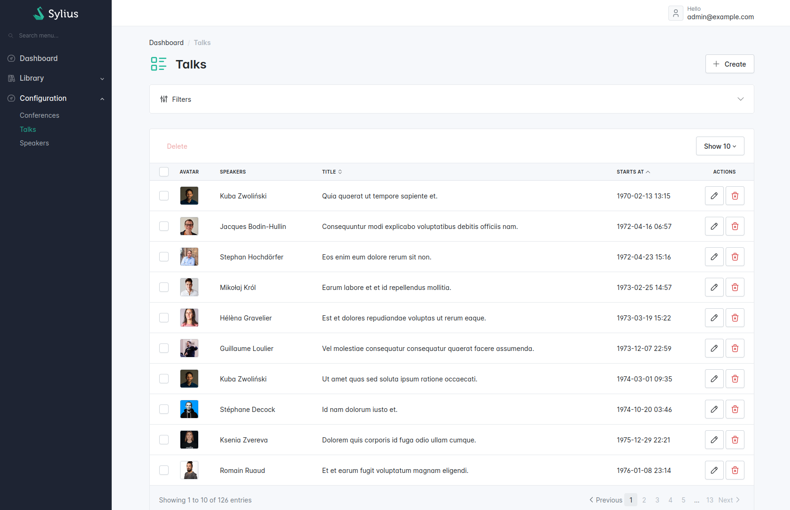
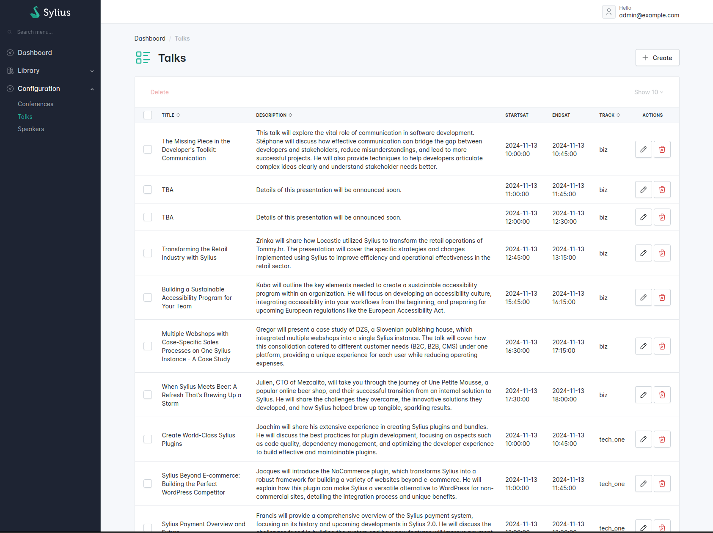
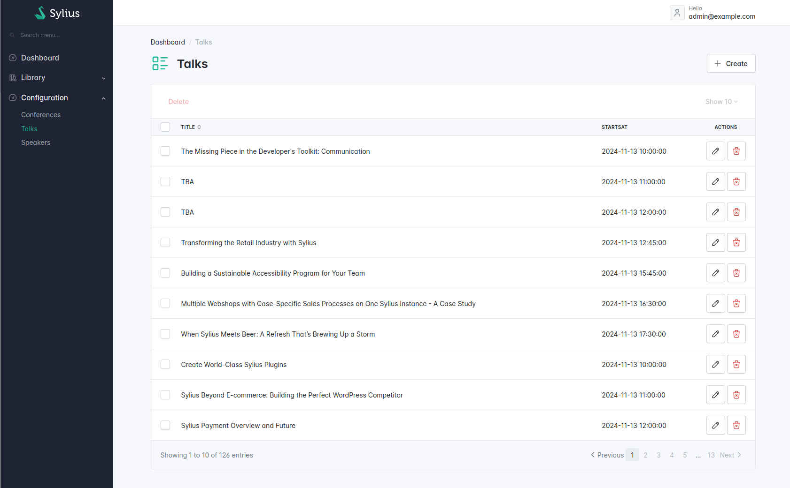
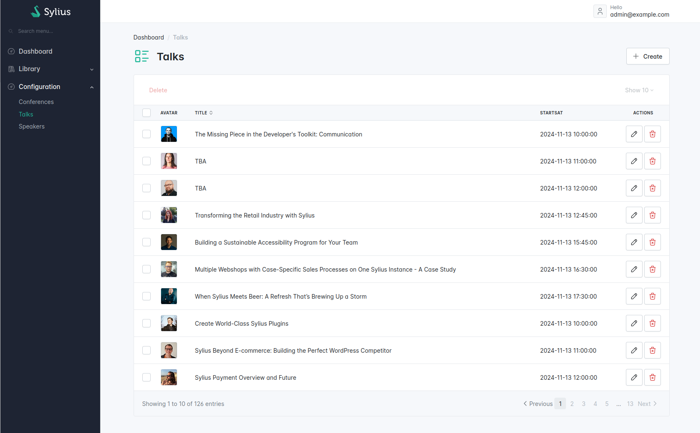
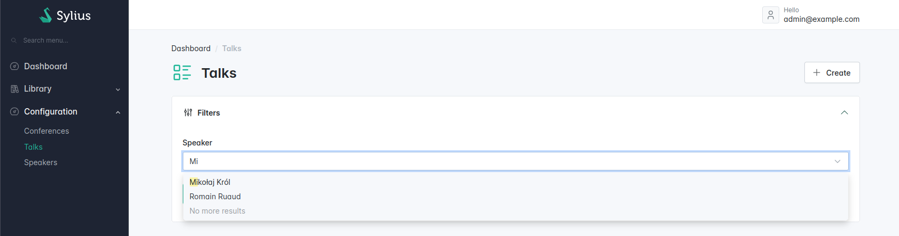

# Customizing your grids

<div data-full-width="false"><figure><figcaption></figcaption></figure></div>

Based on the grid generated by default, our goal here is to obtain a nicely customized grid with autocomplete filters and more!

<figure><figcaption></figcaption></figure>

Let's imagine we have the following grid.


```php
<?php

namespace App\Grid;

use App\Entity\Talk;
use Sylius\Bundle\GridBundle\Builder\Action\CreateAction;
use Sylius\Bundle\GridBundle\Builder\Action\DeleteAction;
use Sylius\Bundle\GridBundle\Builder\Action\ShowAction;
use Sylius\Bundle\GridBundle\Builder\Action\UpdateAction;
use Sylius\Bundle\GridBundle\Builder\ActionGroup\BulkActionGroup;
use Sylius\Bundle\GridBundle\Builder\ActionGroup\ItemActionGroup;
use Sylius\Bundle\GridBundle\Builder\ActionGroup\MainActionGroup;
use Sylius\Bundle\GridBundle\Builder\Field\DateTimeField;
use Sylius\Bundle\GridBundle\Builder\Field\StringField;
use Sylius\Bundle\GridBundle\Builder\GridBuilderInterface;
use Sylius\Bundle\GridBundle\Grid\AbstractGrid;
use Sylius\Component\Grid\Attribute\AsGrid;

#[AsGrid(
    name: 'app_talk',
    resourceClass: Talk::class,
)]
final class TalkGrid extends AbstractGrid
{
    public function __construct()
    {
        // TODO inject services if required
    }

    public function __invoke(GridBuilderInterface $gridBuilder): void
    {
        $gridBuilder
            // see https://github.com/Sylius/SyliusGridBundle/blob/master/docs/field_types.md
            ->addField(
                StringField::create('title')
                    ->setLabel('Title')
                    ->setSortable(true)
            )
            ->addField(
                StringField::create('description')
                    ->setLabel('Description')
                    ->setSortable(true)
            )
            ->addField(
                DateTimeField::create('startsAt')
                    ->setLabel('StartsAt')
            )
            ->addField(
                DateTimeField::create('endsAt')
                    ->setLabel('EndsAt')
            )
            ->addField(
                StringField::create('track')
                    ->setLabel('Track')
                    ->setPath('track.value')
                    ->setSortable(true)
            )
            ->addActionGroup(
                MainActionGroup::create(
                    CreateAction::create(),
                )
            )
            ->addActionGroup(
                ItemActionGroup::create(
                    // ShowAction::create(),
                    UpdateAction::create(),
                    DeleteAction::create()
                )
            )
            ->addActionGroup(
                BulkActionGroup::create(
                    DeleteAction::create()
                )
            )
        ;
    }
}
```


## Fields

<div data-full-width="false"><figure><figcaption></figcaption></figure></div>

Let's clean up our grid and remove unnecessary fields.


```php
<?php

namespace App\Grid;

use App\Entity\Talk;
use Sylius\Bundle\GridBundle\Builder\Action\CreateAction;
use Sylius\Bundle\GridBundle\Builder\Action\DeleteAction;
use Sylius\Bundle\GridBundle\Builder\Action\ShowAction;
use Sylius\Bundle\GridBundle\Builder\Action\UpdateAction;
use Sylius\Bundle\GridBundle\Builder\ActionGroup\BulkActionGroup;
use Sylius\Bundle\GridBundle\Builder\ActionGroup\ItemActionGroup;
use Sylius\Bundle\GridBundle\Builder\ActionGroup\MainActionGroup;
use Sylius\Bundle\GridBundle\Builder\Field\DateTimeField;
use Sylius\Bundle\GridBundle\Builder\Field\StringField;
use Sylius\Bundle\GridBundle\Builder\GridBuilderInterface;
use Sylius\Bundle\GridBundle\Grid\AbstractGrid;
use Sylius\Component\Grid\Attribute\AsGrid;

#[AsGrid(
    name: 'app_talk',
    resourceClass: Talk::class,
)]
final class TalkGrid extends AbstractGrid
{
    public function __invoke(GridBuilderInterface $gridBuilder): void
    {
        $gridBuilder
            ->addField(
                StringField::create('title')
                    ->setLabel('Title')
                    ->setSortable(true)
            )
            ->addField(
                DateTimeField::create('startsAt')
                    ->setLabel('StartsAt')
            )
            ->addActionGroup(
                MainActionGroup::create(
                    CreateAction::create(),
                )
            )
            ->addActionGroup(
                ItemActionGroup::create(
                    // ShowAction::create(),
                    UpdateAction::create(),
                    DeleteAction::create()
                )
            )
            ->addActionGroup(
                BulkActionGroup::create(
                    DeleteAction::create()
                )
            )
        ;
    }
}
```


We have removed the `description`, `endsAt` and `track` grid fields.

<div data-full-width="false"><figure><figcaption></figcaption></figure></div>

## Adding the speaker avatar using Twig field

<div data-full-width="false"><figure><figcaption></figcaption></figure></div>

Now, let's add the speaker avatar into our talk grid.

```php
<?php

namespace App\Grid;

use Sylius\Bundle\GridBundle\Builder\Field\TwigField;
use Sylius\Bundle\GridBundle\Builder\GridBuilderInterface;
use Sylius\Bundle\GridBundle\Grid\AbstractGrid;
use Sylius\Component\Grid\Attribute\AsGrid;
// ...

#[AsGrid(
    name: 'app_talk',
    resourceClass: Talk::class,
)]
final class TalkGrid extends AbstractGrid
{
    // ...

    public function __invoke(GridBuilderInterface $gridBuilder): void
    {
        $gridBuilder
            ->addField(
                TwigField::create('avatar', 'talk/grid/field/speaker_avatar.html.twig')
                    ->setPath('.')
                    ->setLabel('app.ui.avatar'),
            )
            // ...
        ;
    }

    // ...
}
```


```php
{{ avatar.default(avatar_path, 'img-thumbnail') }}
```


## Filters

### Adding an autocomplete filter

<div data-full-width="false"><figure><figcaption></figcaption></figure></div>

We'd like to filter our talks by a specific speaker.

So, let's start by creating a FormType following the [Symfony UX Autocomplete Documentation](https://symfony.com/bundles/ux-autocomplete/current/index.html#usage-in-a-form-with-ajax)


```php
declare(strict_types=1);

namespace App\Form;

use App\Entity\Speaker;
use Symfony\Component\Form\AbstractType;
use Symfony\Component\OptionsResolver\OptionsResolver;
use Symfony\UX\Autocomplete\Form\AsEntityAutocompleteField;
use Symfony\UX\Autocomplete\Form\BaseEntityAutocompleteType;

#[AsEntityAutocompleteField(
    alias: 'app_admin_speaker',
    route: 'ux_entity_autocomplete_admin',
)]
final class SpeakerAutocompleteType extends AbstractType
{
    public function configureOptions(OptionsResolver $resolver): void
    {
        $resolver->setDefaults([
            'class' => Speaker::class,
            'choice_label' => 'fullName',
        ]);
    }

    public function getParent(): string
    {
        return BaseEntityAutocompleteType::class;
    }
}
```


Now we need to create our custom Grid filter.


```php
<?php

declare(strict_types=1);

namespace App\Grid\Filter;

use App\Form\SpeakerAutocompleteType;
use Sylius\Component\Grid\Attribute\AsFilter;
use Sylius\Component\Grid\Data\DataSourceInterface;
use Sylius\Component\Grid\Filter\EntityFilter;
use Sylius\Component\Grid\Filtering\FilterInterface;

#[AsFilter(
    formType: SpeakerAutocompleteType::class,
    template: '@SyliusBootstrapAdminUi/shared/grid/filter/select.html.twig',
)]
final class SpeakerFilter implements FilterInterface
{
    public function __construct(
        private readonly EntityFilter $entityFilter,
    ) {
    }

    public function apply(DataSourceInterface $dataSource, string $name, mixed $data, array $options): void
    {
        // We simply reuse the logic of the built-in EntityFilter provided by the Sylius Grid package.
        $this->entityFilter->apply($dataSource, $name, $data, $options);
    }
}
```


Then, we add our `SpeakerFilter` to our grid.


```php
<?php

declare(strict_types=1);

namespace App\Grid;

use App\Grid\Filter\SpeakerFilter;
use Sylius\Bundle\GridBundle\Builder\Filter\Filter;
use Sylius\Bundle\GridBundle\Builder\GridBuilderInterface;
use Sylius\Bundle\GridBundle\Grid\AbstractGrid;
use Sylius\Bundle\GridBundle\Grid\ResourceAwareGridInterface;
use Sylius\Component\Grid\Attribute\AsGrid;
// ...

#[AsGrid(
    name: 'app_talk',
    resourceClass: Talk::class,
)]
final class TalkGrid extends AbstractGrid
{
    // ...

    public function __invoke(GridBuilderInterface $gridBuilder): void
    {
        $gridBuilder
            ->addFilter(
                Filter::create(name: 'speaker', type: SpeakerFilter::class)
                    ->setLabel('app.ui.speaker')
            );
            
            // ...
    }

    // ...
}
```

