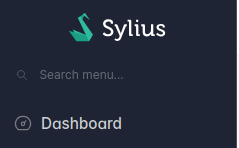
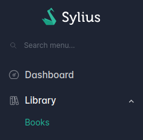

# Customizing the menu

## How to customize the sidebar menu

### Decorate the sidebar menu

<div data-full-width="false">

<figure></figure>

</div>

To customize the admin menu, you need to decorate the `sylius_admin_ui.knp.menu_builder` service.

```php
declare(strict_types=1);

namespace App\Menu;

use Knp\Menu\FactoryInterface;
use Knp\Menu\ItemInterface;
use Sylius\AdminUi\Knp\Menu\MenuBuilderInterface;
use Symfony\Component\DependencyInjection\Attribute\AsDecorator;

#[AsDecorator(decorates: 'sylius_admin_ui.knp.menu_builder')]
final readonly class MenuBuilder implements MenuBuilderInterface
{
    public function __construct(
        private readonly FactoryInterface $factory,
    ) {
    }

    public function createMenu(array $options): ItemInterface
    {
        $menu = $this->factory->createItem('root');

        $menu
            ->addChild('dashboard', [
                'route' => 'sylius_admin_ui_dashboard',
            ])
            ->setLabel('sylius.ui.dashboard')
            ->setLabelAttribute('icon', 'tabler:dashboard')
        ;

        return $menu;
    }
}
```

### Add submenu items

<div data-full-width="false">

<figure></figure>

</div>

Now you can add submenu items:

```php
// ...
#[AsDecorator(decorates: 'sylius_admin_ui.knp.menu_builder')]
final readonly class MenuBuilder implements MenuBuilderInterface
{
    // ...
    
    public function createMenu(array $options): ItemInterface
    {
        $menu = $this->factory->createItem('root');
        // ...
        $this->addLibrarySubMenu($menu);

        return $menu;
    }
    
    private function addLibrarySubMenu(ItemInterface $menu): void
    {
        $library = $menu
            ->addChild('library')
            ->setLabel('app.ui.library')
            ->setLabelAttribute('icon', 'tabler:books')
        ;

        $library->addChild('books', ['route' => 'app_admin_book_index'])
            ->setLabel('app.ui.books')
            ->setLabelAttribute('icon', 'book')
        ;
    }
}
```


**🧠 Collapse your custom menu by default**

It's possible to expand your parent menu category on page load by default. For that, you have to set the `setExtra` attribute like this:

```php
$newSubmenu = $menu
    ->addChild('new')
    ->setLabel('Custom Admin Menu')
    ->setExtra('always_open', true);
```

However, ensure that you set the attribute in the parent menu, not in one of the child menu items.

