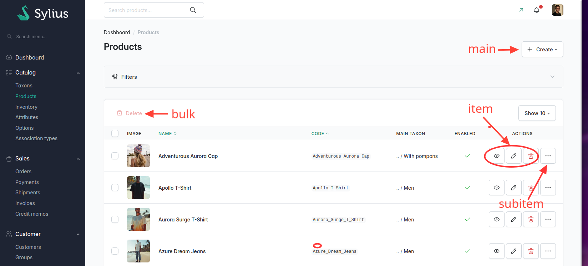

# Actions

## Action groups

<div data-full-width="false">

<figure></figure>

</div>

Actions are classified into four types:

- main
- item
- subitem
- bulk

## Built-in actions

The grid package provides the following built-in actions:

| Name             | Usage      |
|------------------|------------|
| create           | main       |
| update           | item, bulk |
| delete           | item, bulk |
| show             | item       |
| apply_transition | item, bulk |

### Create

```php
<?php

declare(strict_types=1);

namespace App\Grid;

use App\Entity\Speaker;
use Sylius\Bundle\GridBundle\Builder\Action\CreateAction;
use Sylius\Bundle\GridBundle\Builder\ActionGroup\MainActionGroup;
use Sylius\Bundle\GridBundle\Builder\GridBuilderInterface;
use Sylius\Bundle\GridBundle\Grid\AbstractGrid;
use Sylius\Component\Grid\Attribute\AsGrid;

#[AsGrid(
    resourceClass: Speaker::class,
    name: 'app_speaker',
)]
final class SpeakerGrid extends AbstractGrid
{
    public function __invoke(GridBuilderInterface $gridBuilder): void
    {
        $gridBuilder
            ->addActionGroup(
                MainActionGroup::create(
                    // Add the "create" action into the "main" action group
                    CreateAction::create(),
                ),
            )
        ;
    }
}
```

### Update

```php
<?php

declare(strict_types=1);

namespace App\Grid;

use App\Entity\Speaker;
use Sylius\Bundle\GridBundle\Builder\Action\UpdateAction;
use Sylius\Bundle\GridBundle\Builder\ActionGroup\ItemActionGroup;
use Sylius\Bundle\GridBundle\Builder\GridBuilderInterface;
use Sylius\Bundle\GridBundle\Grid\AbstractGrid;
use Sylius\Component\Grid\Attribute\AsGrid;

#[AsGrid(
    resourceClass: Speaker::class,
    name: 'app_speaker',
)]
final class SpeakerGrid extends AbstractGrid
{
    public function __invoke(GridBuilderInterface $gridBuilder): void
    {
        $gridBuilder
            ->addActionGroup(
                ItemActionGroup::create(
                    // Add the "update" action into the "item" action group
                    UpdateAction::create(),
                ),
            )
        ;
    }
}
```

### Delete

```php
<?php

declare(strict_types=1);

namespace App\Grid;

use App\Entity\Speaker;
use Sylius\Bundle\GridBundle\Builder\Action\DeleteAction;
use Sylius\Bundle\GridBundle\Builder\ActionGroup\BulkActionGroup;
use Sylius\Bundle\GridBundle\Builder\ActionGroup\ItemActionGroup;
use Sylius\Bundle\GridBundle\Builder\GridBuilderInterface;
use Sylius\Bundle\GridBundle\Grid\AbstractGrid;
use Sylius\Component\Grid\Attribute\AsGrid;

#[AsGrid(
    resourceClass: Speaker::class,
    name: 'app_speaker',
)]
final class SpeakerGrid extends AbstractGrid
{
    public function __invoke(GridBuilderInterface $gridBuilder): void
    {
        $gridBuilder
            ->addActionGroup(
                ItemActionGroup::create(
                    // Add the "delete" action into the "item" action group
                    DeleteAction::create(),
                ),
            )
            ->addActionGroup(
                BulkActionGroup::create(
                    // Add the "delete" action into the "bulk" action group
                    DeleteAction::create(),
                ),
            )
        ;
    }
}
```

### Show

```php
<?php

declare(strict_types=1);

namespace App\Grid;

use App\Entity\Speaker;
use Sylius\Bundle\GridBundle\Builder\Action\ShowAction;
use Sylius\Bundle\GridBundle\Builder\ActionGroup\ItemActionGroup;
use Sylius\Bundle\GridBundle\Builder\GridBuilderInterface;
use Sylius\Bundle\GridBundle\Grid\AbstractGrid;
use Sylius\Component\Grid\Attribute\AsGrid;

#[AsGrid(
    resourceClass: Speaker::class,
    name: 'app_speaker',
)]
final class SpeakerGrid extends AbstractGrid
{
    public function __invoke(GridBuilderInterface $gridBuilder): void
    {
        $gridBuilder
            ->addActionGroup(
                ItemActionGroup::create(
                    // Add the "show" action into the "item" action group
                    ShowAction::create(),
                ),
            )
        ;
    }
}
```

## Creating a custom Action

There are certain cases when built-in action types are not enough.

All you need to do is create your own action template and register it
for the `sylius_grid`.

In this example, we will specify the action button's icon to be `mail` and its
colour to be `purple` inside the template.



```twig




{{ buttons.default(path, action.label, null, 'mail', 'purple') }}
```



Now configure the new action's template like below in
`config/packages/sylius_grid.yaml`:



```yaml
sylius_grid:
    templates:
        action:
            contactSupplier: "@App/Grid/Action/contactSupplier.html.twig"
```



From now on, you can use your new action type in the grid configuration!

Let's assume that you already have a route for contacting your
suppliers, then you can configure the grid action:





```yaml
sylius_grid:
    grids:
        app_admin_supplier:
            driver:
                name: doctrine/orm
                options:
                    class: App\Entity\Supplier
            actions:
                item:
                    contactSupplier:
                        type: contactSupplier
                        label: Contact Supplier
                        options:
                            link:
                                route: app_admin_contact_supplier
                                parameters:
                                    id: resource.id
```







```php
<?php

use App\Entity\Supplier;
use Sylius\Bundle\GridBundle\Builder\Action\Action;
use Sylius\Bundle\GridBundle\Builder\ActionGroup\ItemActionGroup;
use Sylius\Bundle\GridBundle\Builder\GridBuilder;
use Sylius\Bundle\GridBundle\Config\GridConfig;

return static function (GridConfig $grid): void {
    $grid->addGrid(GridBuilder::create('app_admin_supplier', Supplier::class)
        ->addActionGroup(
            ItemActionGroup::create(
                Action::create('contactSupplier', 'contactSupplier')
                    ->setLabel('Contact Supplier')
                    ->setOptions([
                        'link' => [
                            'route' => 'app_admin_contact_supplier',
                            'parameters' => [
                                'id' => 'resource.id',
                            ],
                        ],
                    ])
            )
        ])
    )
};
```



OR



```php
<?php

declare(strict_types=1);

namespace App\Grid;

use App\Entity\Supplier;
use Sylius\Bundle\GridBundle\Builder\Action\Action;
use Sylius\Bundle\GridBundle\Builder\ActionGroup\ItemActionGroup;
use Sylius\Bundle\GridBundle\Builder\GridBuilderInterface;
use Sylius\Bundle\GridBundle\Grid\AbstractGrid;
use Sylius\Bundle\GridBundle\Grid\ResourceAwareGridInterface;

final class AdminSupplierGrid extends AbstractGrid implements ResourceAwareGridInterface
{
    public static function getName(): string
    {
           return 'app_admin_supplier';
    }

    public function buildGrid(GridBuilderInterface $gridBuilder): void
    {
        $gridBuilder
            ->addActionGroup(
                ItemActionGroup::create(
                    Action::create('contactSupplier', 'contactSupplier')
                        ->setLabel('Contact Supplier')
                        ->setOptions([
                            'link' => [
                                'route' => 'app_admin_contact_supplier',
                                'parameters' => [
                                    'id' => 'resource.id',
                                ],
                            ],
                        ])
                )
            ])
        ;    
    }
    
    public function getResourceClass(): string
    {
        return Supplier::class;
    }
}
```





## Creating a custom Bulk Action

In some cases, forcing the user to click a button for each item in a grid isn't practical.
Fortunately, you can take advantage of built-in bulk actions. However, these may not always be sufficient and might need
customization.

To do this, simply create your own bulk action template and register it inside the `sylius_grid`.

In the template we will specify the button's icon to be `export` and its
colour to be `orange`.



```twig




{{ buttons.default(path, action.label, null, 'export', 'orange') }}
```



Now configure the new action's template:



```yaml
sylius_grid:
    templates:
        bulk_action:
            export: "@App/Grid/BulkAction/export.html.twig"
```



From now on, you can use your new bulk action type in the grid configuration!

Let's assume that you already have a route for exporting by injecting
ids. Now, you can configure the grid action:





```yaml
sylius_grid:
    grids:
        app_admin_product:
            ...
            actions:
                bulk:
                    export:
                        type: export
                        label: Export Data
                        options:
                            link:
                                route: app_admin_product_export
                                parameters:
                                    format: csv
```







```php
<?php

use App\Entity\Product;
use Sylius\Bundle\GridBundle\Builder\Action\Action;
use Sylius\Bundle\GridBundle\Builder\ActionGroup\BulkActionGroup;
use Sylius\Bundle\GridBundle\Builder\GridBuilder;
use Sylius\Bundle\GridBundle\Builder\Field\Field;
use Sylius\Bundle\GridBundle\Config\GridConfig;

return static function (GridConfig $grid) {
    $grid->addGrid(GridBuilder::create('app_admin_product', Product::class)
        ->addActionGroup(
            BulkActionGroup::create(
                Action::create('export', 'export')
                    ->setLabel('Export Data')
                    ->setOptions([
                        'link' => [
                            'route' => 'app_admin_product_export',
                            'parameters' => [
                                'format' => 'csv',
                            ],
                        ]
                    ])
            )
        )
    )
};
```



OR



```php
<?php

declare(strict_types=1);

namespace App\Grid;

use App\Entity\Product;
use Sylius\Bundle\GridBundle\Builder\Action\Action;
use Sylius\Bundle\GridBundle\Builder\ActionGroup\BulkActionGroup;
use Sylius\Bundle\GridBundle\Builder\GridBuilderInterface;
use Sylius\Bundle\GridBundle\Grid\AbstractGrid;
use Sylius\Bundle\GridBundle\Grid\ResourceAwareGridInterface;

final class AdminProductGrid extends AbstractGrid implements ResourceAwareGridInterface
{
    public static function getName(): string
    {
           return 'app_admin_product';
    }

    public function buildGrid(GridBuilderInterface $gridBuilder): void
    {
        $gridBuilder
            ->addActionGroup(
                BulkActionGroup::create(
                    Action::create('export', 'export')
                        ->setLabel('Export Data')
                        ->setOptions([
                            'link' => [
                                'route' => 'app_admin_product_export',
                                'parameters' => [
                                    'format' => 'csv',
                                ],
                            ]
                        ])
                )
            )
        ;    
    }
    
    public function getResourceClass(): string
    {
        return Product::class;
    }
}
```




