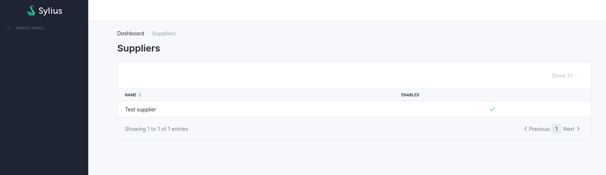
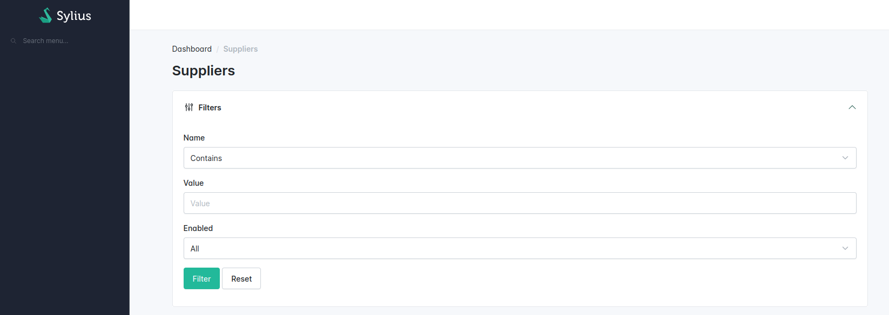
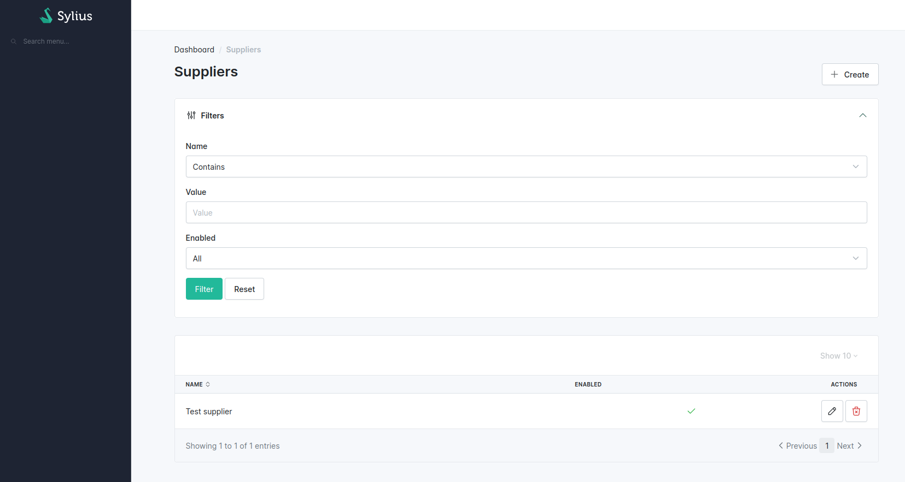

# Creating your first grid

In order to use grids, you need to register your entity as a Sylius resource. Let us assume you have a Supplier model in your application, which represents a supplier of goods in your shop and has several fields, including _name_, _description_ and _enabled_.

In order to make it a Sylius resource, you need to add the `AsResource` attribute and implement `ResourceInterface`.


```php
namespace App\Entity;

use Sylius\Resource\Metadata\AsResource;
use Sylius\Resource\Model\ResourceInterface;

#[AsResource]
class Supplier implements ResourceInterface
{
    // ...
}
```


That's it! Your class is now a resource. In order to learn what it means, please refer to the [SyliusResourceBundle](../resource/index.md) documentation.

## Grid Maker

You can create your grid using the [Symfony Maker bundle](https://symfony.com/bundles/SymfonyMakerBundle/current/index.html).


Since SyliusGridBundle 1.14, this command supports any PHP class, including Sylius Resources too !&#x20;


```shell
$ bin/console make:grid
```


This command will generate a grid with a field entry for each of your PHP class properties except `id`.


## Grid Definition

Now we can configure our first grid:




```php
<?php

declare(strict_types=1);

namespace App\Grid;

use App\Entity\Supplier;
use Sylius\Bundle\GridBundle\Builder\Field\StringField;
use Sylius\Bundle\GridBundle\Builder\Field\TwigField;
use Sylius\Bundle\GridBundle\Builder\GridBuilderInterface;
use Sylius\Bundle\GridBundle\Grid\AbstractGrid;
use Sylius\Component\Grid\Attribute\AsGrid;

#[AsGrid(
    name: 'app_admin_supplier',
    resourceClass: Supplier::class
)]
final class AdminSupplierGrid extends AbstractGrid
{

    public function __invoke(GridBuilderInterface $gridBuilder): void
    {
         $gridBuilder->addField(
                StringField::create('name')
                    ->setLabel('app.ui.name')
            )
            ->addField(
                TwigField::create('enabled', '@SyliusBootstrapAdminUi/shared/grid/field/boolean.html.twig')
                    ->setLabel('app.ui.enabled')
            )
        ;
    }
}
```





```php
<?php 

use App\Entity\Supplier;
use Sylius\Bundle\GridBundle\Builder\GridBuilder;
use Sylius\Bundle\GridBundle\Builder\Field\StringField;
use Sylius\Bundle\GridBundle\Builder\Field\TwigField;
use Sylius\Bundle\GridBundle\Config\GridConfig;

return static function (GridConfig $grid) {
    $grid->addGrid(GridBuilder::create('app_admin_supplier', Supplier::class)
        ->addField(
            StringField::create('name')
                ->setLabel('app.ui.name')
        )
        ->addField(
            TwigField::create('enabled', '@SyliusBootstrapAdminUi/shared/grid/field/boolean.html.twig')
                ->setLabel('app.ui.enabled')
        )
    )
};
```





```yaml
sylius_grid:
    grids:
        app_admin_supplier:
            driver:
                name: doctrine/orm
                options:
                    class: App\Entity\Supplier
            fields:
                name:
                    type: string
                    label: app.ui.name
                enabled:
                    type: twig
                    label: app.ui.enabled
                    options:
                        template: '@SyliusBootstrapAdminUi/shared/grid/field/boolean.html.twig' # This will be a checkbox field
```





Available field types are `string`, `datetime`, `callable` and `twig`.  The Twig field type is particularly powerful and can be leveraged to render more complex fields (booleans, combinations of resource properties etc) and gives you full flexibility of styling.


## Using your grid on an index operation

The `SyliusResourceBundle` allows you to use a grid into an index operation:


```php
namespace App\Entity;

use App\Grid\AdminSupplierGrid;
use Sylius\Resource\Metadata\AsResource;
use Sylius\Resource\Metadata\Index;
use Sylius\Resource\Model\ResourceInterface;

#[AsResource(
    section: 'admin', // This will influence the route name
    routePrefix: '/admin',
    templatesDir: '@SyliusAdminUi/crud', // This directory contains the generic template for your list
    operations: [
        // You can use either the FQCN of your grid
        new Index(grid: AdminSupplierGrid::class)
        // Or you can use the grid name
        new Index(grid: 'app_admin_supplier')
    ],
)]
class Supplier implements ResourceInterface
{
    // ...
}
```


This will generate the following path:

```shell
 ------------------------------ ---------------------------
  Name                           Path                                           
 ------------------------------ ---------------------------                  
  app_admin_supplier_index           /admin/suppliers               
```


See how to add this new page into your [administration menu](../cookbook/admin_panel/menu.md).


Now, your new grid should look like this when accessing the index on _/admin/suppliers/_:



## Defining Filters

To allow users to search for specific items in the grid, you can use filters.




```php
<?php

declare(strict_types=1);

namespace App\Grid;

use App\Entity\Supplier;
use Sylius\Bundle\GridBundle\Builder\Filter\BooleanFilter;
use Sylius\Bundle\GridBundle\Builder\Filter\StringFilter;
use Sylius\Bundle\GridBundle\Builder\GridBuilderInterface;
use Sylius\Bundle\GridBundle\Grid\AbstractGrid;

#[AsGrid(
    name: 'app_admin_supplier',
    resourceClass: Supplier::class,
)]
final class AdminSupplierGrid extends AbstractGrid
{
    public function __invoke(GridBuilderInterface $gridBuilder): void
    {
        $gridBuilder
            ->addFilter(
                StringFilter::create('name')
                    ->setLabel('Name')
            )
            ->addFilter(
                BooleanFilter::create('enabled')   
                    ->setLabel('Enabled')
            )
        ;
    }
}
```





```php
<?php

use App\Entity\Supplier;
use Sylius\Bundle\GridBundle\Builder\GridBuilder;
use Sylius\Bundle\GridBundle\Builder\Filter\BooleanFilter;
use Sylius\Bundle\GridBundle\Builder\Filter\StringFilter;
use Sylius\Bundle\GridBundle\Config\GridConfig;

return static function (GridConfig $grid) {
    $grid->addGrid(GridBuilder::create('app_admin_supplier', Supplier::class)
        ->addFilter(
            StringFilter::create('name')
                ->setLabel('Name')
        )
        ->addFilter(
            BooleanFilter::create('enabled')
               ->setLabel('Enabled')
        )
    )
};
```





```yaml
sylius_grid:
    grids:
        app_admin_supplier:
            # ...
            filters:
                name:
                    type: string
                    label: Name
                enabled:
                    type: boolean
                    label: Enabled
```




What will it look like in the admin panel?



### Advanced filtering : relationships

What about filtering by fields of related entities? For instance if you would like to filter your suppliers by their country of origin, which is a property of the associated address entity.

There are 2 ways you can do this :&#x20;

* you can resort to a custom [repository method](https://docs.sylius.com/en/latest/customization/repository.html)  and pass it to the Grid Builder via `setRepositoryMethod()` but this will only work when using Doctrine
* or you can join on your entities directly inside your provider when using a custom data provider

#### Custom repository method (Doctrine-only)




```php
<?php

declare(strict_types=1);

namespace App\Grid;

use App\Entity\Supplier;
use Sylius\Bundle\GridBundle\Builder\Filter\BooleanFilter;
use Sylius\Bundle\GridBundle\Builder\Filter\StringFilter;
use Sylius\Bundle\GridBundle\Builder\GridBuilderInterface;
use Sylius\Bundle\GridBundle\Grid\AbstractGrid;

#[AsGrid(
    name: 'app_admin_supplier',
    resourceClass: Supplier::class,
)]
final class AdminSupplierGrid extends AbstractGrid
{
    public function __invoke(GridBuilderInterface $gridBuilder): void
    {
        $gridBuilder->setRepositoryMethod('mySupplierGridQuery');
    }
}
```





```php
<?php

use App\Entity\Supplier;
use Sylius\Bundle\GridBundle\Builder\GridBuilder;
use Sylius\Bundle\GridBundle\Builder\Filter\BooleanFilter;
use Sylius\Bundle\GridBundle\Builder\Filter\StringFilter;
use Sylius\Bundle\GridBundle\Config\GridConfig;

return static function (GridConfig $grid) {
    $grid->addGrid(GridBuilder::create('app_admin_supplier', Supplier::class)
        ->setRepositoryMethod('mySupplierGridQuery')
    )
};
```





```yaml
sylius_grid:
    grids:
        app_admin_supplier:
            driver:
                name: doctrine/orm
                options:
                    class: App\Entity\Supplier
                    repository:
                        method: mySupplierGridQuery
```





The repository method must return a `QueryBuilder` object, as the query needs to adjust based on the filters and sorting the user will apply later.  Furthermore, all sub-entities you wish to use later on for filtering must be joined explicitly in the query.


#### Custom data provider

Here is a simple example of a custom data provider. You're obviously free to actually fetch your data in whatever way suits your need, by calling a repository of any kind (Doctrine, API, in-memory,..) directly or call a query bus for instance.&#x20;


```php
<?php

namespace App\Grid\Provider;

use App\Repository\SupplierRepository;
use App\Resource\SupplierResource;
use Pagerfanta\Adapter\FixedAdapter;
use Pagerfanta\Pagerfanta;
use Pagerfanta\PagerfantaInterface;
use Sylius\Component\Grid\Data\DataProviderInterface;
use Sylius\Component\Grid\Definition\Grid;
use Sylius\Component\Grid\Parameters;

final readonly class SupplierGridProvider implements DataProviderInterface
{
    public function __construct(
        private SupplierRepository $supplierRepository,
    ) {
    }

    public function getData(Grid $grid, Parameters $parameters): PagerFantaInterface
    {
        $page = (int) $parameters->get('page', 1);
        $itemsPerPage = (int) $parameters->get('limit', 10);
        $criteria = $parameters->get('criteria');

        $paginator = $this->getSuppliersPaginator($page, $itemsPerPage, $criteria);

        $data = [];

        foreach ($paginator as $row) {
            $data[] = new SupplierResource(
                enabled: $row['enabled'],
                name: $row['name'],
               // ...
            );
        }

        return new Pagerfanta(new FixedAdapter($paginator->count(), $data));
    }

    public function getSuppliersPaginator(int $page, int $itemsPerPage, ?array $criteria): PagerfantaInterface
    {
        $supplierRepository = $this->supplierRepository;

        if (!empty($criteria['country'] ?? null)) {
            $supplierRepository = $supplierRepository->withCountryCode($criteria['country']);
        }

        return $supplierRepository->withPagination($page, $itemsPerPage)->paginator();
    }
}
```


Then, this example Doctrine repository uses a JOIN statement on our related Address Entity.


```php
<?php

declare(strict_types=1);

namespace App\Repository;

use App\Doctrine\DoctrineRepository;
use Doctrine\ORM\EntityManagerInterface;
use Doctrine\ORM\QueryBuilder;

// this example DoctrineRepository would manage boilerplate iterators, pagination etc 
final class SupplierRepository extends DoctrineRepository 
{

    private const string ENTITY_CLASS = Supplier::class;
    private const string ALIAS = 'supplier';
    private const string ADDRESS_ALIAS = 'address';

    public function __construct(EntityManagerInterface $em)
    {
        parent::__construct($em, self::ENTITY_CLASS, self::ALIAS);

        $this->queryBuilder
            ->innerJoin(sprintf('%s.address', self::ALIAS), self::ADDRESS_ALIAS);
    }
    
    public function withCountryCode(string $countryCode): static
    {
        return $this->filter(static function (QueryBuilder $queryBuilder) use ($countryCode): void {
            $queryBuilder
                ->andWhere($queryBuilder->expr()->eq(sprintf('%s.countryCode', self::ADDRESS_ALIAS), ':countryCode'))
                ->setParameter('countryCode', $countryCode)
            ;
        });
    }
    
    // ....
    
}
```


#### Adding your entity filter to your grid

Then you can simply insert your filter inside the grid.




```php
<?php

declare(strict_types=1);

namespace App\Grid;

use App\Entity\Supplier;
use App\Grid\Provider\SupplierGridProvider;
use Sylius\Bundle\GridBundle\Builder\Filter\StringFilter;
use Sylius\Bundle\GridBundle\Builder\GridBuilderInterface;
use Sylius\Bundle\GridBundle\Grid\AbstractGrid;
use Sylius\Component\Grid\Attribute\AsGrid;

#[AsGrid(
    name: 'app_admin_supplier',
    provider: SupplierGridProvider::class, // only needed if you used a custom provider
    resourceClass: Supplier::class, // only needed if you did NOT use a provider
)]
final class AdminSupplierGrid extends AbstractGrid
{
    public function __invoke(GridBuilderInterface $gridBuilder): void
    {
        $gridBuilder
            ->addFilter(
                StringFilter::create('country', ['address.country'], 'contains')
                    ->setLabel('origin')
            )
        ;
    }
    
    // ...
}
```





```php
<?php

use App\Entity\Supplier;
use Sylius\Bundle\GridBundle\Builder\GridBuilder;
use Sylius\Bundle\GridBundle\Builder\Filter\StringFilter;
use Sylius\Bundle\GridBundle\Config\GridConfig;

return static function (GridConfig $grid) {
    $grid->addGrid(GridBuilder::create('app_admin_supplier', Supplier::class)
        ->addFilter(
            StringFilter::create('country', ['address.country'], 'contains')
                ->setLabel('origin')
        )
    )
};
```





```yaml
sylius_grid:
    grids:
        app_admin_supplier:
            # ...
            filters:
                # ...
                country:
                    type: string
                    label: origin
                    options:
                        fields: [address.country]
                    form_options:
                        type: contains
```




## Default Sorting

You can define by which field you want the grid to be sorted and how using `orderBy()` .




```php
<?php

declare(strict_types=1);

namespace App\Grid;

use App\Entity\Supplier;
use Sylius\Bundle\GridBundle\Builder\GridBuilderInterface;
use Sylius\Bundle\GridBundle\Grid\AbstractGrid;
use Sylius\Bundle\GridBundle\Grid\ResourceAwareGridInterface;
use Sylius\Component\Grid\Attribute\AsGrid;

#[AsGrid(
    name: 'app_admin_supplier',
    resourceClass: Supplier::class,
)]
final class AdminSupplierGrid extends AbstractGrid
{
    public function __invoke(GridBuilderInterface $gridBuilder): void
    {
        $gridBuilder->orderBy(name: 'name', direction: 'asc');
    }
}
```







```php
<?php

use App\Entity\Supplier;
use Sylius\Bundle\GridBundle\Builder\GridBuilder;
use Sylius\Bundle\GridBundle\Config\GridConfig;

return static function (GridConfig $grid) {
    $grid->addGrid(GridBuilder::create('app_admin_supplier', Supplier::class)
        ->orderBy('name', 'asc')
    )
};
```





```yaml
sylius_grid:
    grids:
        app_admin_supplier:
            # ...
            sorting:
                name: asc
                # ...
```




Then in the fields section, indicate that the field can be used for sorting with `setSortable()`:




```php
<?php

declare(strict_types=1);

namespace App\Grid;

use App\Entity\Supplier;
use Sylius\Bundle\GridBundle\Builder\Field\StringField;
use Sylius\Bundle\GridBundle\Builder\GridBuilderInterface;
use Sylius\Bundle\GridBundle\Grid\AbstractGrid;
use Sylius\Component\Grid\Attribute\AsGrid;

#[AsGrid(
    name: 'app_admin_supplier',
    resourceClass: Supplier::class,
)]
final class AdminSupplierGrid extends AbstractGrid
{
    public function __invoke(GridBuilderInterface $gridBuilder): void
    {
        $gridBuilder
            ->addField(
                StringField::create('name')
                    ->setLabel('sylius.ui.name')
                    ->setSortable(true)
            )
        ;
    }

}
```





```php
<?php

use App\Entity\Supplier;
use Sylius\Bundle\GridBundle\Builder\Field\StringField;
use Sylius\Bundle\GridBundle\Builder\GridBuilder;
use Sylius\Bundle\GridBundle\Config\GridConfig;

return static function (GridConfig $grid) {
    $grid->addGrid(GridBuilder::create('app_admin_supplier', Supplier::class)
        ->addField(
            StringField::create('name')
                ->setLabel('sylius.ui.name')
                ->setSortable(true)
        )
    )
};
```





```yaml
sylius_grid:
    grids:
        app_admin_supplier:
            # ...
            fields:
                name:
                    type: string
                    label: sylius.ui.name
                    sortable: ~
                # ...
```




If your field is not of a "simple" type, e.g. a Twig template with a specific path, you can enable sorting with the following definition:




```php
<?php

declare(strict_types=1);

namespace App\Grid;

use App\Entity\Supplier;
use Sylius\Bundle\GridBundle\Builder\Field\TwigField;
use Sylius\Bundle\GridBundle\Builder\GridBuilderInterface;
use Sylius\Bundle\GridBundle\Grid\AbstractGrid;
use Sylius\Component\Grid\Attribute\AsGrid;

#[AsGrid(
    name: 'app_admin_supplier',
    resourceClass: Supplier::class,
)]
final class AdminSupplierGrid extends AbstractGrid
{
    public function __invoke(GridBuilderInterface $gridBuilder): void
    {
        $gridBuilder
            ->addField(
                TwigField::create('name', '@App/Grid/Fields/my_country_flags.html.twig')
                    ->setPath('address.country')
                    ->setLabel('app.ui.country')
                    ->setSortable(true, 'address.country')
            )
        ;
    } 
}
```





```php
<?php

use App\Entity\Supplier;
use Sylius\Bundle\GridBundle\Builder\Field\TwigField;
use Sylius\Bundle\GridBundle\Builder\GridBuilder;
use Sylius\Bundle\GridBundle\Config\GridConfig;

return static function (GridConfig $grid) {
    $grid->addGrid(GridBuilder::create('app_admin_supplier', Supplier::class)
        ->addField(
            TwigField::create('name', '@App/Grid/Fields/myCountryFlags.html.twig')
                ->setPath('address.country')
                ->setLabel('app.ui.country')
                ->setSortable(true, 'address.country')
        )
    )
};
```





```yaml
sylius_grid:
    grids:
        app_admin_supplier:
            # ...
            fields:
                # ...
                origin:
                    type: twig
                    options:
                        template: "@App/Grid/Fields/myCountryFlags.html.twig"
                    path: address.country
                    label: app.ui.country
                    sortable: address.country
                # ...
```




## Pagination

You can limit how many items are visible on each page by providing an array of integers into the `limits` parameter. The first element of the array will be treated as the default.


Pagination limits are set by default to 10, 25 and 50 items per page. In order to turn it off, configure `limits: ~` .





```php
<?php

declare(strict_types=1);

namespace App\Grid;

use App\Entity\Supplier;
use Sylius\Bundle\GridBundle\Builder\GridBuilderInterface;
use Sylius\Bundle\GridBundle\Grid\AbstractGrid;
use Sylius\Component\Grid\Attribute\AsGrid;

#[AsGrid(
    name: 'app_admin_supplier',
    resourceClass: Supplier::class,
)]
final class AdminSupplierGrid extends AbstractGrid
{
    public function __invoke(GridBuilderInterface $gridBuilder): void
    {
        $gridBuilder->setLimits([12, 24, 48]);
    }
}
```





```yaml
sylius_grid:
    grids:
        app_admin_supplier:
            limits: 
                - 12
                - 24
                - 48
```





```php
<?php

use App\Entity\Supplier;
use Sylius\Bundle\GridBundle\Builder\GridBuilder;
use Sylius\Bundle\GridBundle\Config\GridConfig;

return static function (GridConfig $grid) {
    $grid->addGrid(
        GridBuilder::create('app_admin_supplier', Supplier::class)
                        ->setLimits([12, 24, 48])
    );
};
```




## Actions Configuration

Next step is adding some actions to the grid: create, update and delete.

First, we need to create these operations on our resource:


```php
namespace App\Entity;

use App\Grid\AdminSupplierGrid;
use Sylius\Resource\Metadata\AsResource;
use Sylius\Resource\Metadata\Create;
use Sylius\Resource\Metadata\Delete;
use Sylius\Resource\Metadata\Index;
use Sylius\Resource\Metadata\Update;
use Sylius\Resource\Model\ResourceInterface;

#[AsResource(
    // ...
    operations: [
        new Create(),
        new Update(),
        new Delete(),
        // ...
    ],
)]
class Supplier implements ResourceInterface
{
    // ...
}
```


These new operations are now available:

```shell
 ------------------------------ -----------------------------
  Name                           Path                                           
 ------------------------------ -----------------------------         
  app_admin_supplier_create     /admin/suppliers/new                           
  app_admin_supplier_update     /admin/suppliers/{id}/edit                     
  app_admin_supplier_delete     /admin/suppliers/{id}/delete                   
  app_admin_supplier_index      /admin/suppliers                 
```

Then we need to add these operations into our Grid using Actions.


There are two types of actions that can be added to a grid:&#x20;

* `main` actions affect the entire grid, such as adding new items or deleting items in bulk
* &#x20;and `item` actions which apply to a single row of the grid (one object), such as editing or deleting.





```php
<?php

declare(strict_types=1);

namespace App\Grid;

use App\Entity\Supplier;
use Sylius\Bundle\GridBundle\Builder\Action\CreateAction;
use Sylius\Bundle\GridBundle\Builder\Action\DeleteAction;
use Sylius\Bundle\GridBundle\Builder\Action\UpdateAction;
use Sylius\Bundle\GridBundle\Builder\ActionGroup\ItemActionGroup;
use Sylius\Bundle\GridBundle\Builder\ActionGroup\MainActionGroup;
use Sylius\Bundle\GridBundle\Builder\GridBuilderInterface;
use Sylius\Bundle\GridBundle\Grid\AbstractGrid;
use Sylius\Component\Grid\Attribute\AsGrid;

#[AsGrid(
    name: 'app_admin_supplier',
    resourceClass: Supplier::class,
)]
final class AdminSupplierGrid extends AbstractGrid
{
    public function __invoke(GridBuilderInterface $gridBuilder): void
    {
        $gridBuilder
            ->addActionGroup(
                MainActionGroup::create(
                    CreateAction::create()
                )
            )
            ->addActionGroup(
                ItemActionGroup::create(
                    UpdateAction::create(),
                    DeleteAction::create()
                )
            )
        ;
    }
}
```





```php
<?php

use App\Entity\Supplier;
use Sylius\Bundle\GridBundle\Builder\Action\CreateAction;
use Sylius\Bundle\GridBundle\Builder\Action\DeleteAction;
use Sylius\Bundle\GridBundle\Builder\Action\UpdateAction;
use Sylius\Bundle\GridBundle\Builder\ActionGroup\ItemActionGroup;
use Sylius\Bundle\GridBundle\Builder\ActionGroup\MainActionGroup;
use Sylius\Bundle\GridBundle\Builder\GridBuilder;
use Sylius\Bundle\GridBundle\Config\GridConfig;

return static function (GridConfig $grid) {
    $grid->addGrid(GridBuilder::create('app_admin_supplier', Supplier::class)
        ->addActionGroup(
            MainActionGroup::create(
                CreateAction::create()
            )
        )
        ->addActionGroup(
            ItemActionGroup::create(
                UpdateAction::create(),
                DeleteAction::create()
            )
        )
    )
};
```





```yaml
sylius_grid:
    grids:
        app_admin_supplier:
            # ...
            actions:
                main:
                    create:
                        type: create
                item:
                    update:
                        type: update
                    delete:
                        type: delete
```




This activates such a view on the `/admin/suppliers/` path:



Your grid is ready to use!
