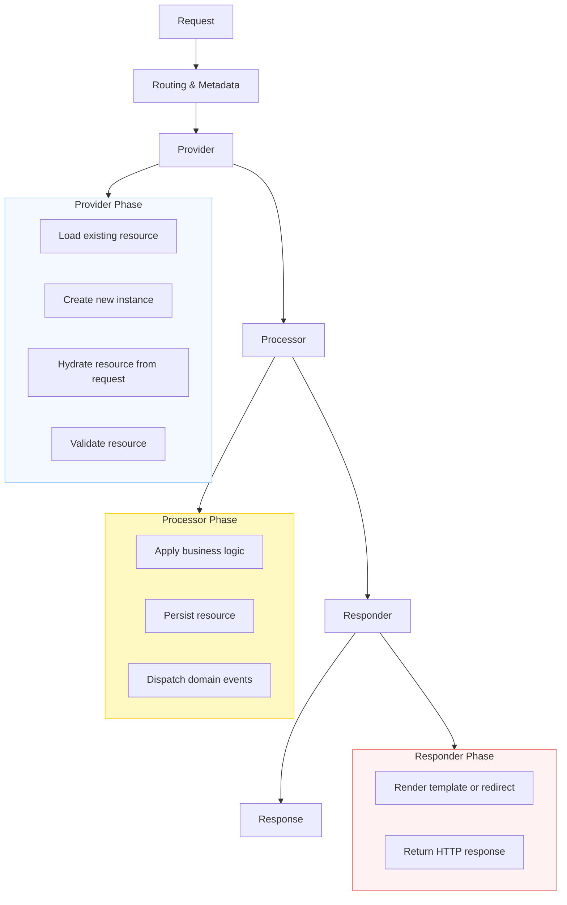

# Resource Lifecycle

Each operation on a resource follows a well-defined lifecycle.  
This flow ensures clear separation of concerns between reading data, applying business logic, and producing the final response.

## Step-by-step explanation

### Routing & Metadata
The request is matched to a `Resource` and an `Operation` using metadata collected from attributes (eg `#[AsResource]`).  
This step defines which provider, processor, and responder should handle the request.

### Provider Phase
The provider is responsible for loading or creating the resource object, hydrating it from the request, and validating it before any business logic is applied.

**Example:** load from Doctrine, create a new instance, populate from request data, validate, or fetch from an external API.

### Processor Phase
The processor applies the business logic of the operation.

**Example:** persist the entity, execute domain services, or dispatch events.

You can use the default Doctrine processor, or implement your own for DDD use cases.

### Responder Phase
The responder produces the final output — it can render a Twig template or redirect to another route.
